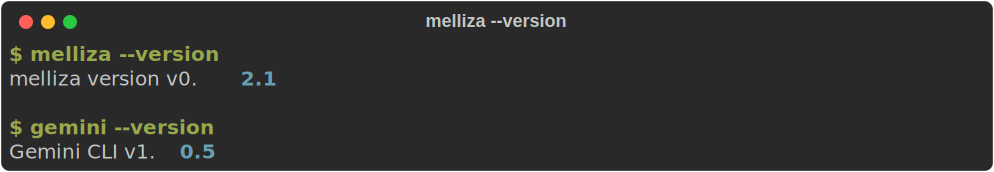

# Installation

Melliza is distributed as a single binary with no runtime dependencies. Choose your preferred installation method below.

## Prerequisites

Before installing Melliza, ensure you have **Gemini CLI** installed and authenticated:

    code-group

```bash [npm (recommended)]
# Install Gemini CLI globally
npm install -g @google/gemini-cli

# Authenticate (opens browser)
gemini login
```

```bash [npx (no install)]
# Run directly without installing
npx @google/gemini-cli login
```

   

!!! tip Verify Gemini CLI Installation
Run `gemini --version` to confirm Gemini CLI is installed. Melliza will not work without it.
   

### Optional: GitHub CLI (`gh`)

If you want Melliza to automatically create pull requests when a PRD completes, install the [GitHub CLI](https://cli.github.com/):

```bash
# macOS
brew install gh

# Linux
# See https://github.com/cli/cli/blob/trunk/docs/install_linux.md

# Authenticate
gh auth login
```

The `gh` CLI is only required for automatic PR creation. All other features work without it.

## Homebrew (Recommended)

The easiest way to install Melliza on **macOS** or **Linux**:

```bash
brew install lvcoi/melliza/melliza
```

This method:
- Automatically handles updates via `brew upgrade`
- Installs to `/opt/homebrew/bin/melliza` (Apple Silicon) or `/usr/local/bin/melliza` (Intel/Linux)
- Works on macOS (Apple Silicon and Intel) and Linux (x64 and ARM64)

### Updating

The easiest way to update is Melliza's built-in update command, which works regardless of how you installed:

```bash
melliza update
```

If you installed via Homebrew, you can also use:

```bash
brew update && brew upgrade melliza
```

Melliza automatically checks for updates on startup and notifies you when a new version is available.

## Install Script

Download and install with a single command:

```bash
curl -fsSL https://raw.githubusercontent.com/minicodemonkey/melliza/main/install.sh | bash
```

The script automatically detects your platform and downloads the appropriate binary.

### Script Options

| Option | Description | Example |
|--------|-------------|---------|
| `--version` | Install a specific version | `--version v0.1.0` |
| `--dir` | Install to a custom directory | `--dir /opt/melliza` |
| `--help` | Show all available options | `--help` |

**Examples:**

```bash
# Install a specific version
curl -fsSL https://raw.githubusercontent.com/minicodemonkey/melliza/main/install.sh | bash -s -- --version v0.1.0

# Install to a custom directory
curl -fsSL https://raw.githubusercontent.com/minicodemonkey/melliza/main/install.sh | bash -s -- --dir ~/.local/bin

# Both options combined
curl -fsSL https://raw.githubusercontent.com/minicodemonkey/melliza/main/install.sh | bash -s -- --version v0.1.0 --dir /opt/melliza
```

!!! info Custom Directory
If you install to a custom directory, make sure it's in your `PATH`:
```bash
export PATH="$HOME/.local/bin:$PATH"
```
Add this to your shell profile (`.bashrc`, `.zshrc`, etc.) to persist it.
   

## Manual Binary Download

Download the binary for your platform from the [GitHub Releases page](https://github.com/lvcoi/melliza/releases).

### Platform Matrix

| Platform | Architecture | Binary Name | Notes |
|----------|-------------|-------------|-------|
| macOS | Apple Silicon (M1/M2/M3) | `melliza-darwin-arm64` | Recommended for modern Macs |
| macOS | Intel (x64) | `melliza-darwin-amd64` | For older Intel-based Macs |
| Linux | x64 (AMD64) | `melliza-linux-amd64` | Most common Linux servers |
| Linux | ARM64 | `melliza-linux-arm64` | Raspberry Pi 4, AWS Graviton |

### Installation Steps

    code-group

```bash [macOS Apple Silicon]
# Download the binary
curl -LO https://github.com/lvcoi/melliza/releases/latest/download/melliza-darwin-arm64

# Make it executable
chmod +x melliza-darwin-arm64

# Move to a directory in your PATH
sudo mv melliza-darwin-arm64 /usr/local/bin/melliza
```

```bash [macOS Intel]
# Download the binary
curl -LO https://github.com/lvcoi/melliza/releases/latest/download/melliza-darwin-amd64

# Make it executable
chmod +x melliza-darwin-amd64

# Move to a directory in your PATH
sudo mv melliza-darwin-amd64 /usr/local/bin/melliza
```

```bash [Linux x64]
# Download the binary
curl -LO https://github.com/lvcoi/melliza/releases/latest/download/melliza-linux-amd64

# Make it executable
chmod +x melliza-linux-amd64

# Move to a directory in your PATH
sudo mv melliza-linux-amd64 /usr/local/bin/melliza
```

```bash [Linux ARM64]
# Download the binary
curl -LO https://github.com/lvcoi/melliza/releases/latest/download/melliza-linux-arm64

# Make it executable
chmod +x melliza-linux-arm64

# Move to a directory in your PATH
sudo mv melliza-linux-arm64 /usr/local/bin/melliza
```

   

!!! tip Detect Your Architecture
Not sure which binary you need? Run these commands:
```bash
# macOS
uname -m  # arm64 = Apple Silicon, x86_64 = Intel

# Linux
uname -m  # x86_64 = AMD64, aarch64 = ARM64
```
   

## Building from Source

Build Melliza from source if you want the latest development version or need to customize the build.

### Prerequisites

- **Go 1.21** or later ([install Go](https://go.dev/doc/install))
- **Git** for cloning the repository

### Build Steps

```bash
# Clone the repository
git clone https://github.com/lvcoi/melliza.git
cd melliza

# Build the binary
go build -o melliza ./cmd/melliza

# Optionally install to your GOPATH/bin
go install ./cmd/melliza
```

### Build with Version Info

For a release-quality build with version information embedded:

```bash
go build -ldflags "-X main.version=$(git describe --tags --always)" -o melliza ./cmd/melliza
```

### Verify the Build

```bash
./melliza --version
```

## Verifying Installation

After installing via any method, verify Melliza is working correctly:

```bash
# Check the version
melliza --version

# View help
melliza --help

# Check that Gemini CLI is accessible
gemini --version
```

Expected output:

<div style="max-width: 600px; margin: 1rem 0;">
  
</div>

!!! warning Troubleshooting
If `melliza` is not found after installation:
1. Check that the installation directory is in your `PATH`
2. Open a new terminal window/tab to reload your shell
3. Run `which melliza` to see if it's found and where

See the [Troubleshooting Guide](../troubleshooting/common-issues.md) for more help.
   

## Next Steps

Now that Melliza is installed:

1. **[Quick Start Guide](quick-start.md)** - Get running with your first PRD
2. **[How Melliza Works](../concepts/how-it-works.md)** - Understand the autonomous agent concept
3. **[CLI Reference](../reference/cli.md)** - Explore all available commands
