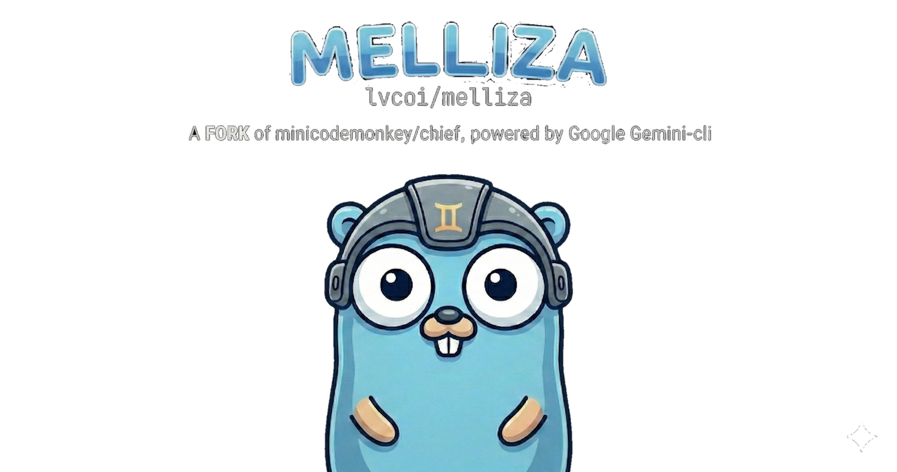
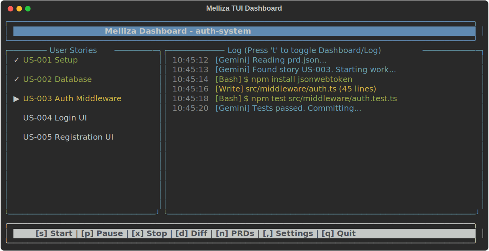

# 🚀 Meet Melliza

  

**Build Big Projects with Gemini**

Melliza breaks your work into tasks. Gemini builds them one by one. 

  

## ✨ Get Started

Melliza is an **autonomous agent loop** that orchestrates the **Gemini CLI** to work through user stories in a **Product Requirements Document (PRD)**. Let's get building!

*   ⚡ [Quick Start](guide/quick-start.md)
*   💻 [Installation](guide/installation.md)
*   🧠 [How it Works](concepts/how-it-works.md)

## 🛠️ Core Features

*   **🤖 Autonomous Loop**: Orchestrates Gemini CLI to work through user stories without manual intervention.
*   **📄 PRD-Driven Development**: Work directly from human-readable `prd.md` files.
*   **📈 Persistent Progress**: Progress is tracked in `prd.json` and `progress.md`, ensuring work can be resumed across sessions.
*   **🖥️ TUI Dashboard**: A real-time terminal user interface to monitor Gemini's progress, logs, and diffs.
*   **🌿 Smart Worktrees**: Automatically creates git branches or worktrees for each PRD to keep your main workspace clean.
*   **✅ Auto-Commit & Test**: Gemini implements the story, runs your project's tests, and commits changes automatically.

---

  <a href="https://github.com/lvcoi/melliza" style="display: inline-block; padding: 10px 24px; background: rgba(255, 255, 255, 0.1); border-radius: 8px; text-decoration: none; font-weight: bold; border: 1px solid rgba(255,255,255,0.2);">⭐ View on GitHub</a>

