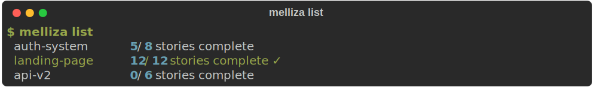

# CLI Reference

Melliza provides a minimal but powerful CLI. All commands operate on the current working directory's `.melliza/` folder.

## Usage

```
melliza [command] [flags]
```

**Available Commands:**

| Command | Description |
|---------|-------------|
| *(default)* | Run the Ralph Loop on the active PRD |
| `new` | Create a new PRD in the current project |
| `edit` | Open the PRD for editing |
| `status` | Show current PRD progress |
| `list` | List all PRDs in the project |
| `update` | Update Melliza to the latest version |

## Commands

### melliza (default)

Launch the TUI dashboard for the active PRD. This opens Melliza in **Ready** state—press `s` to start the Ralph Loop, which then reads your PRD, selects stories, and invokes Gemini CLI iteratively.

```bash
melliza [name]
```

**Arguments:**

| Argument | Description |
|----------|-------------|
| `name` | PRD name to run (optional, auto-detects if omitted) |

**Flags:**

| Flag | Description | Default |
|------|-------------|---------|
| `--max-iterations <n>`, `-n` | Maximum loop iterations | Dynamic |
| `--no-retry` | Disable auto-retry on Gemini crashes | `false` |
| `--verbose` | Show raw Gemini output in log | `false` |

**Examples:**

```bash
# Run with auto-detected PRD
melliza

# Run a specific PRD by name
melliza auth-system

# Increase iteration limit for large PRDs
melliza --max-iterations 200

# Combine flags
melliza auth-system -n 50 --verbose
```

!!! info Dynamic iteration limit
When `--max-iterations` is not specified, Melliza calculates a dynamic limit based on the number of remaining stories plus a buffer. You can adjust the limit at runtime with `+`/`-` in the TUI.
   

!!! tip
If your project has only one PRD, Melliza auto-detects it. Pass a name when you have multiple PRDs.
   


### melliza edit

Open an existing PRD for editing via Gemini CLI.

```bash
melliza edit
```

Launches Gemini CLI with your PRD loaded, allowing you to refine requirements, add stories, or update `prd.md` conversationally. When you `/exit`, Melliza regenerates `prd.json` from the updated `prd.md`.

**Arguments:**

| Argument | Description |
|----------|-------------|
| `name` | PRD name to edit (optional, auto-detects if omitted) |

**Flags:**

| Flag | Description |
|------|-------------|
| `--merge` | Auto-merge progress on conversion conflicts |
| `--force` | Auto-overwrite on conversion conflicts |

**Examples:**

```bash
# Edit the auto-detected PRD
melliza edit

# Edit a specific PRD
melliza edit auth-system

# Edit and auto-merge progress
melliza edit auth-system --merge
```


### melliza list

List all PRDs in the current project.

```bash
melliza list
```

Scans `.melliza/prds/` and shows each PRD with its completion status.

**Examples:**

```bash
# List all PRDs
melliza list
```

<div style="max-width: 600px; margin: 1rem 0;">
  
</div>


## Keyboard Shortcuts (TUI)

When Melliza is running, the TUI provides real-time feedback and interactive controls:

### Loop Control

| Key | Action |
|-----|--------|
| `s` | **Start** the loop (when Ready, Paused, Stopped, or Error) |
| `p` | **Pause** the loop (finishes current iteration gracefully) |
| `x` | **Stop** the loop immediately (kills Gemini process) |

### View Switching

| Key | Action |
|-----|--------|
| `t` | **Toggle** between Dashboard and Log views |
| `d` | **Toggle** Diff view (shows the selected story's commit diff) |

### PRD Management

| Key | Action |
|-----|--------|
| `n` | Open **PRD picker** in create mode (switch PRDs or create new) |
| `l` | Open **PRD picker** in selection mode (switch between existing PRDs) |
| `1-9` | **Quick switch** to PRD tabs 1-9 |
| `e` | **Edit** current PRD via Gemini CLI (from any main view) |
| `m` | **Merge** completed PRD's branch into main (in picker or completion screen) |
| `c` | **Clean** worktree and optionally delete branch (in picker or completion screen) |

### Settings

| Key | Action |
|-----|--------|
| `,` | Open **Settings** overlay (from any view) |

### Navigation

| Key | Action |
|-----|--------|
| `j` / `↓` | Move down (stories in Dashboard, scroll in Log/Diff) |
| `k` / `↑` | Move up (stories in Dashboard, scroll in Log/Diff) |
| `Ctrl+D` / `PgDn` | Page down (Log/Diff view) |
| `Ctrl+U` / `PgUp` | Page up (Log/Diff view) |
| `g` | Jump to top (Log/Diff view) |
| `G` | Jump to bottom (Log/Diff view) |
| `+` / `=` | Increase max iterations by 5 |
| `-` / `_` | Decrease max iterations by 5 |

### General

| Key | Action |
|-----|--------|
| `?` | Show **help** overlay (context-aware) |
| `Esc` | Close modals/overlays |
| `q` | **Quit** (gracefully stops all loops) |
| `Ctrl+C` | Force quit |

!!! tip
The TUI has three views: **Dashboard** showing stories and progress, **Log** streaming Gemini's output in real time, and **Diff** showing the commit diff for the selected story. Press `t` to toggle Dashboard/Log, or `d` to open the Diff view.
   

## Exit Codes

Melliza uses standard exit codes:

| Code | Meaning |
|------|---------|
| `0` | Success |
| `1` | Error |
